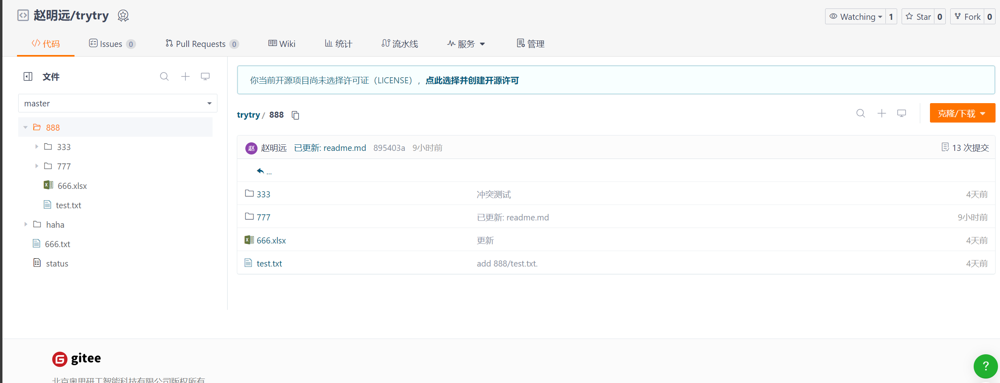

# 开发随记

## 稀疏检出注意事项
后端随记，前端可以不管
### 启动初始化
```cmd
git config core.sparseCheckout true

# 执行初始化并设置成非cone模式
git sparse-checkout set --no-cone

```
### 启动后进行检查：
1. 检查.git下config中有无
```txt
[core]
    sparseCheckout = true
```
2. .git/info/下有无sparse-checkout文件

3. sparse-checkout文件内容格式应该如下：
```txt
${target_floder}
!/*
```

### 更新完后执行重新拉取
```cmd
git sparse-checkout reapply
```
- 执行后，相应更改的文档便会重新拉取，并且删除不必要的文档

## 前端需开发接口

### 一、文件树解析

请求`git-tree`接口会返回如下格式信息
```json
{
    "success": true,
    "message": "获取文件树成功",
    "data": {
        "root": {
          ".gitignore": {},
          "app.js": {},
          "config": {
            "gitConfig.js": {}
          },
          "controllers": {
            "gitController.js": {},
            "gitTreeController.js": {},
            "sshController.js": {}
          },
          "examples": {
            "useFileTreeIndex.js": {}
          },
          "package.json": {},
          "public": {
            "3333.txt": {},
            "hello.txt": {},
            "hello1.txt": {},
            "hello5.txt": {},
            "temp": {
              "gitee_id_rsa_1745845010860.pub": {},
              "id_ed25519_1745311729219.pub": {},
              "id_test_1745312938693.pub": {}
            },
            "this.txt": {}
          },
          "readme.md": {},
          "routes": {
            "git-tree.js": {},
            "git.js": {},
            "index.js": {},
            "ssh.js": {}
          },
          "utils": {
            "fileUtils.js": {},
            "gitTreeUtils.js": {},
            "gitUtils.js": {}
          }
      }
    }
  }
```
- 需求:
    1. 解析文件树
    2. 无后缀的默认为文件夹，其余按照后缀名相应渲染图标
    3. 每一层进行渲染
- 方法：
    1. 先取出data
    2. root为仓库根目录，默认展示给用户及时进入的root界面
    3. 用户点进哪一层目录，则json后取哪一个名称，并且展示key，如下命令仅供参考(开发语言和库函数可能不一样，最后写法也不一样)
```javascript
const indexedTree = fileTreeResponse.data;
console.log('完整索引数据:', indexedTree);

const root = indexedTree.root;
console.log('根目录:', root);

const root = indexedTree.root;
console.log('public下目录',indexedTree.root.public)

// 提取第一层的所有项目（包括文件和目录）
const firstLevelItems = Object.keys(root);
console.log('第一层所有项目:', firstLevelItems);
```
### 二、稀疏检出更新
可以简单理解为，这一个接口目的是，让用户处在哪个目录，即`工作区`在哪个目录，也相应拉取这个目录下的文件而不拉取所有文件
- 要求：
  1. 在用户切换文件夹同时，记录下</mark>仓库</mark>的绝对路径
  2. 请求http://localhost:3000/git/sparse-pull(例) 接口，发送如下json
  ```json
  {
    "workspace":"/888/777"
  }
  ```
上述所示路径在仓库中实际如下：

### 三、上传文件
1. 请求接口：http://localhost:3000/git/upload-and-push
2. 接口的样式，其实就是需要附上的信息: 
  - `sourcePath`是电脑里相应文件的路径，要求绝对路径(这里是linux的路径，不用管，就是右键复制文件路径复制的即为绝对路径)
  - `targetRelativePath`需要放到哪个文件夹下，即可以理解为用户要当前位于哪个文件夹，也就要放在哪，这个是仓库内的路径
json格式如下
```json
  {
    "sourcePath": "/home/zhao/Free_Disk/readme.md",
    "targetRelativePath": "888/777/666"
  }
```