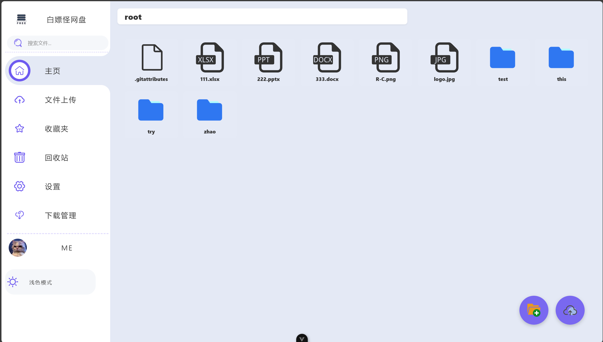

# 白嫖怪网盘

<div align="center">
  
  <p>基于 Git 的轻量高效网盘解决方案</p>
</div>

## 📝 项目介绍

白嫖怪网盘是一个基于 `Node.js` 和 `Git` 技术栈开发的开源网盘系统后端，专为个人和小团队设计。项目整合了 Git 的版本控制能力与现代网盘系统的易用性，提供了一套完整的文件存储与管理解决方案。

**核心特色**：
- 利用 Git 的**版本控制**系统实现文件历史追踪
- 通过**稀疏检出**技术优化大型仓库访问速度
- 支持 **Git LFS** 存储大文件
- 提供标准 **RESTful API** 接口，支持与多种前端框架集成

👉 [白嫖怪网盘前端项目](https://github.com/Zmy0312bry/Free_disk_front)
## ✨ 项目优势

### 🚀 高性能设计
- **稀疏检出优化**：选择性拉取需要的文件，显著降低网络传输量
- **增量同步机制**：仅同步修改的文件，提升传输效率
- **并发处理能力**：支持多用户同时操作，性能稳定可靠

### 🛡️ 安全可靠
- **版本控制**：基于 Git 的版本控制能力，支持文件历史追踪与回滚
- **SSH密钥认证**：采用安全的 SSH 密钥机制进行身份验证
- **数据一致性**：确保文件传输和存储的完整性

### 💡 智能特性
- **LFS大文件支持**：针对大文件优化的存储和传输方案
- **自动化配置**：提供一键配置功能，降低使用门槛
- **状态监控**：实时监控系统运行状态，提供详细日志

### 🔧 扩展性强
- **模块化设计**：清晰的代码结构，便于功能扩展
- **RESTful API**：标准化的接口设计，支持多端接入
- **配置灵活**：支持自定义配置，适应不同场景需求

## 🎮 功能特性

- 🗂️ **文件管理**
  - 文件夹创建和管理
  - 文件上传和下载
  - 文件版本控制
  
- 🔧 **Git 集成**
  - 稀疏检出支持
  - Git LFS 支持
  - 安全的推送机制
  
- 🔐 **SSH 密钥管理**
  - SSH 密钥生成
  - 公钥获取
  
- ⚙️ **系统配置**
  - 仓库路径配置
  - 远程仓库配置
  - 用户信息配置
  - 下载路径配置

## 📋 待办事项

1. 支持服务端自定义部署
2. 支持更多网盘功能（如在线预览、协作编辑）
3. 完善 UI 以及缺失界面，重构生命周期逻辑以支持更快的 Git 命令

## 🚀 快速开始

### 系统要求

- Node.js >= 14
- Git >= 2.25.0
- Git LFS（可选，用于大文件存储）

### 安装步骤

```bash
# 克隆项目
git clone https://github.com/yourusername/Free_Disk.git

# 进入项目目录
cd Free_Disk

# 安装依赖
npm install
```

### 项目配置

项目首次运行前需要进行基础配置：

1. 配置仓库路径
2. 配置远程仓库地址
3. 配置 Git 用户信息
4. 配置下载路径

这些配置可以通过调用相应的 API 接口来完成。

### 启动服务

```bash
# 开发环境运行（支持热重载）
npm run dev

# 生产环境运行
npm start
```

服务将在 http://127.0.0.1:3001 启动

### 调试指南

项目提供了 `Reqable` 调试接口集合，可直接导入调试：

- 接口集合文件：**Free-disk.reqable_collection.json**
- [Reqable 下载链接](https://reqable.com/zh-CN/)

> 💡 **提示**：强烈推荐使用 `Reqable` 进行后端 API 调试！

## 📘 API 文档

### 文件管理接口

#### 创建文件夹
- **POST** `/api/file/folder`
- **功能**：在指定目录下创建新文件夹
- **参数**：
  ```json
  {
    "baseDir": "string",  // 基础目录路径（可选）
    "folderName": "string"  // 要创建的文件夹名称（必需）
  }
  ```
- **返回示例**：
  ```json
  {
    "success": true,
    "path": "/path/to/new/folder"
  }
  ```

#### 复制文件到安装目录
- **POST** `/api/file/copy-to-install`
- **功能**：将文件从仓库复制到安装目录
- **参数**：
  ```json
  {
    "sourcePath": "string"  // 源文件路径（必需）
  }
  ```
- **返回示例**：
  ```json
  {
    "success": true,
    "message": "文件复制完成",
    "sourcePath": "/source/path/file.txt",
    "targetPath": "/install/path/file.txt"
  }
  ```

### Git 相关接口

#### 获取工作空间信息
- **GET** `/api/git/workspace-info`
- **功能**：获取 Git 工作空间的当前状态
- **返回示例**：
  ```json
  {
    "status": "clean",
    "branch": "main",
    "remote": "origin"
  }
  ```

#### 稀疏检出更新
- **POST** `/api/git/sparse-pull`
- **功能**：执行稀疏检出的更新操作
- **参数**：
  ```json
  {
    "paths": ["path1", "path2"]  // 需要检出的路径列表
  }
  ```

#### 文件上传并推送
- **POST** `/api/git/upload-and-push`
- **功能**：上传文件并将其推送到 Git 仓库
- **参数**：
  - `file`：文件（multipart/form-data）
  - `path`：目标路径
- **限制**：文件大小限制为 50MB

#### Git LFS 初始化
- **POST** `/api/git/lfs-update`
- **功能**：初始化或更新 Git LFS 配置

### SSH 管理接口

#### 生成 SSH 密钥
- **POST** `/api/ssh/generate-key`
- **功能**：生成新的 SSH 密钥对

#### 获取 SSH 公钥
- **GET** `/api/ssh/get-key`
- **功能**：获取当前的 SSH 公钥

### 初始化配置接口

#### 获取配置信息
- **GET** `/api/init/config`
- **功能**：获取当前系统配置

#### 更新仓库路径
- **POST** `/api/init/config/repo-path`
- **参数**：
  ```json
  {
    "repoPath": "string"  // 新的仓库路径
  }
  ```

#### 更新远程仓库地址
- **POST** `/api/init/config/remote-url`
- **参数**：
  ```json
  {
    "remoteUrl": "string"  // 新的远程仓库地址
  }
  ```

#### 更新用户配置
- **POST** `/api/init/config/user`
- **参数**：
  ```json
  {
    "name": "string",  // Git 用户名
    "email": "string"  // Git 邮箱
  }
  ```

#### 初始化下载路径
- **POST** `/api/init/config/init-install-path`
- **参数**：
  ```json
  {
    "installPath": "string"  // 下载目录路径
  }
  ```

## 🔄 错误处理

所有接口在发生错误时会返回统一格式的错误响应：

```json
{
  "success": false,
  "error": "错误描述信息"
}
```

在开发环境中，错误响应可能会包含额外的错误堆栈信息：

```json
{
  "success": false,
  "message": "错误描述信息",
  "error": "详细错误堆栈"
}
```

## 📚 集成示例与最佳实践

### 📦 初始化流程（共4步）

1. **创建并配置代码仓库**
   ```http
   POST http://<<HOST>>/init/init-repo
   ```
   `#仓库初始化 #基础配置`

2. **设置远程仓库初始化拉取**
   ```http
   POST http://<<HOST>>/init/init-pull
   ```
   `#远程连接 #访问控制`

3. **稀疏拉取优化**
   ```http
   POST http://<<HOST>>/git/sparse-init-empty
   ```
   `#性能优化 #稀疏拉取节省空间`

4. **配置 Git LFS**
   ```http
   POST http://<<HOST>>/git/lfs-update
   ```
   `#资源管理 #版本控制`

### 📤 文件上传流程（共3步）

1. **创建目录结构**
   ```http
   POST http://<<HOST>>/file/folder
   ```
   `#路径管理 #文件夹操作`

2. **文件上传**
   ```http
   POST http://<<HOST>>/git/upload-and-push
   ```
   `#数据传输 #内容存储`

3. **推送到远程**
   ```http
   POST http://<<HOST>>/git/safe-push
   ```
   `#版本同步 #代码提交`

### 📥 文件下载流程（共2步）

1. **设置文件保存路径**
   ```http
   POST http://<<HOST>>/init/config/init-install-path
   ```
   `#路径配置 #下载准备`

2. **执行文件复制下载**
   ```http
   POST http://<<HOST>>/file/copy-to-install
   ```
   `#内容获取 #文件传输`

### 🔑 配置管理（共4步）

1. **生成 SSH 密钥**
   ```http
   POST http://<<HOST>>/ssh/generate-key
   ```
   `#安全认证 #密钥管理`

2. **获取 SSH 公钥**
   ```http
   GET http://<<HOST>>/ssh/get-key
   ```
   `#信息查询 #状态监控`

3. **更新远程仓库 URL**
   ```http
   POST http://<<HOST>>/init/config/remote-url
   ```
   `#配置更新 #动态调整`

4. **获取配置信息**
   ```http
   GET http://<<HOST>>/init/config
   ```
   `#状态查看 #配置审计`

### ✨ 其他实用接口

- **获取文件树**
   ```http
   GET http://<<HOST>>/git-tree
   ```
   `#便于解析 #获取JSON格式`

- **稀疏检出操作**（需要按顺序调用）
   ```http
   POST http://<<HOST>>/git/sparse-update
   POST http://<<HOST>>/git/sparse-pull
   ```

> 💡 **最佳实践**：按照初始化 → 上传/下载 → 配置管理的顺序调用接口，各流程间建议间隔5秒以上确保状态同步

## 📚 参考资料

1. [Git 稀疏检出官方文档](https://git-scm.cn/docs/git-sparse-checkout#Documentation/git-sparse-checkout.txt-codegitsparse-checkoutsetMYDIR1SUBDIR2code)
2. [Git LFS 官方网站](https://git-lfs.com/) - Git Large File Storage 是一个用于版本控制大文件的开源 Git 扩展
3. [simple-git NPM 包](https://www.npmjs.com/package/simple-git) - Node.js 中使用 Git 的工具库

## 📄 许可证

本项目采用 MIT 许可证

## 🤝 贡献

欢迎贡献代码或提出建议，请通过 GitHub Issues 或 Pull Requests 参与项目。

---

🔗 **相关链接**：[白嫖怪网盘前端](https://github.com/Zmy0312bry/Free_disk_front)
